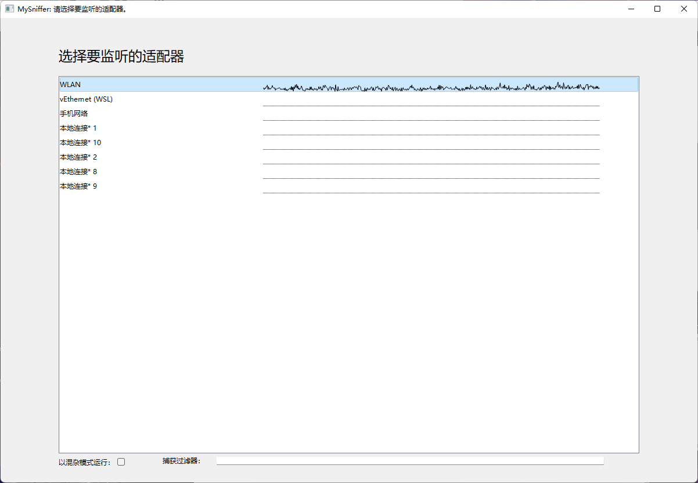
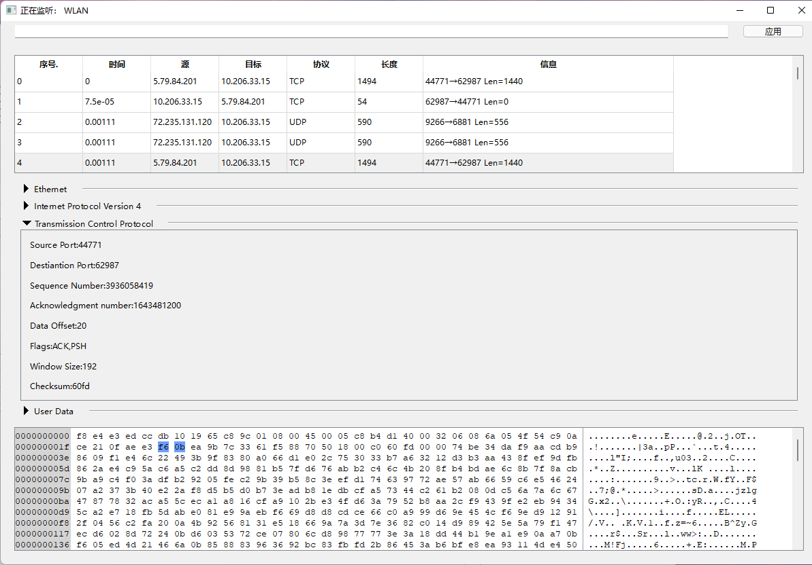

## 基于Npcap的网络嗅探器

### 基本功能：

- 捕获指定适配器上的数据包。
- 对几种常见协议（ARP,IPv4,IPv6,TCP,UDP）的数据包头部进行解释，并通过十六进制查看器查看报文各部分所对应的原始值。
- 支持在捕获和显示时分别进行过滤。
- 基于地址/端口对的流追踪。

接下来将对不同功能分别解释其具体实现。


### 实现细节：

#### 选择适配器

libpcap提供了pcap_findalldevs_ex函数用来列举出所有的网络适配器。但是它返回的适配器描述与系统中适配器名称不一致，难以建立对应关系。

这一函数返回的适配器的“名称”是形如"rpcap://\Device\NPF_{e0d164e6-38d4-4a2e-86fe-473f6d17ca65}"的字符串，可以从中提取出网卡的Guid值，再通过系统提供的IP Helpers函数将它转化为适配器的“别名”，即我们更熟悉的形式。

在等待用户选择的过程中，可以以“统计”模式为每个网卡启动一个线程进行监听，以获得实时的流量信息，如下图所示：



在用户选定适配器后，便可以销毁这些统计线程，并重新创建一个线程对选定的适配器进行监听。

在调用pcap_activate激活监听前，可以设置监听是否要工作在混杂模式、调整缓冲区大小为合适的值，并将监听设置为“立即”模式。

（否则的话，默认的参数会把接收到的包存入缓冲区，在积累了一定数量后再连续调用多次回调函数。从数据包到达，到被用户代码所捕获，可能会有没有上界的延迟。）

而捕获过滤器的编译和应用则要在监听被激活之后进行。因为只有这时，pcap_compile函数才有可能得知网络设备的具体类型。

这里可以特别定义，如果过滤器为空或者没能够通过编译，则不应用任何过滤器。

在进行完这些操作之后，等待pcap_loop函数唤起回调函数，并由回调函数将数据包写入Qt提供的消息队列。


#### 信息提取

如图所示：



每当主线程从队列中取出一个数据包时，它对这一数据包进行基本的解析，并将结果填充进上面的列表中；

当用户在上半部分列表中选定一个数据包时，程序更详细地解析数据包中的各项值，并填充在窗口中部的列表中；当用户展开某个列表并点击某一项时，对应的区段会在十六进制查看其中被标记。

程序把“*任意*”包用一个指向类型EthernetPacket的指针表示，在这一类型的相关函数中判断包的类型并调用其它类型的相关函数去处理下一个包头。

而在创建中间的列表时，程序对于这个包中每一个不同协议的包头，都产生一个以*文本描述,从最外层包头开始的偏移量,长度* 作为叶子节点属性值的树状结构，用来表示要在列表中显示的属性，以及它在十六进制查看器中对应的位置。而这些树状接口被记录在一个双向队列中，按照从下层协议到上层协议的顺序进行显示。

为了方便期间，将报文携带的用户数据也单独抽象成一层，以便用户查看。


#### 包的过滤

##### 监听过滤器

如[前文](####选择适配器)中所述，可以为监听过程的pcap_t通过pcap_compile编译产生一个bpf_program，并通过pcap_set_filter函数指定为这一监听过程的过滤器。

理论上可以在监听过程中进行这一操作。但是考虑到这会导致上下文捕获包的类型不一致，因此程序仅允许在选择适配器时进行监听过滤器的设置。

##### 显示过滤器

除了监听过滤器之外，这一程序自己实现了一个显示过滤器：在程序运行过程中，可以在窗口最上方的输入框中输入待设置的过滤器，并点击右侧的按钮以进行设置。

如果设置成功，则输入框变为绿色，已到达和将要到达的包中，只有符合过滤器的才会被显示在列表中。

如果设置失败，则输入框变为红色，所有包都会显示在列表中。

显示过滤器通过boost.spirit,x3进行编译，语法规则如下：

```
rule = clousure *(OR clousure)
clousule = basic_expr *(AND basic_expr)
basic_expr = (binop / protocol_or_field / (OPEN_PAREN rule CLOSE_PAREN))
binop = value ( EQ / NE / LE / GE / LT / GT ) value
value = protocol_or_field / constant
protocol_or_field = tag *(DOT tag)
tag = ALPHA *(ALPHA / DIGIT)
constant = ipv4_address / ipv6_address / mac_address / INT / BOOL
ipv4_address = INT 3(DOT INT)
ipv6_address = (HEX 7(COLON HEX)) / ([HEX *(COLON HEX)] DCOLON [HEX *(COLON HEX)])
mac_address = (HEX 5(COLON HEX))
OR = "||"
AND = "&&"
OPEN_PAREN = "("
CLOSE_PARAN = ")"
EQ = "=="
NE = "!="
LE = "<="
GE = ">="
LT = "<"
GT = ">"
DOT = "."
COLON = ":"
//ALPHA匹配[a-zA-Z]，DIGIT匹配[0-9]，INT匹配十进制无符号数，BOOL匹配布尔值，HEX匹配十六进制无符号数
```

在具体运行过程中，protocol_or_field必须是已知的78个值中的一个（参考fieldnames.hpp）。

程序会建立一个树状结构，可以通过这一结构对传入的包进行检查并返回一个布尔值作为判断结果。

已有的包会被逐个筛选并决定显示或隐藏；随后，新到达的包会在到达时接受检查。


##### 流追踪

这一程序支持简单的流追踪。

TCP流追踪：

当TCP报文到达时：

​	利用发送端和接收端的(地址，端口)构成的二元集合进行匹配。实际上，我们进行了简单的哈希处理以便于快速匹配。

​	如果键值在活链接的列表里，那么取出对应的链接id；否则，添加到活链接的列表中，并新分配一个id。

​	如果到来的报文包含RST或者FIN选项，则将对应的键值从活链接列表中删除。

​	记录报文对应的流id

​	

当追踪特定TCP流时：

​	通过记录的流id筛选出这个流中涉及的报文。这些报文属于两个不同的方向。

​	在每个方向传输的第一个包时，记录这个方向上当前的SEQ值。

​	如果收到的包的SEQ值匹配记录的SEQ值，则说明没有问题，正常接收；如果大于记录的SEQ，则说明中间有未被捕获的包，在显示时插入一段空数据作为填充；如果小于记录的SEQ，则有部分内容被进行了重传，跳过重复部分即可。

​	对于每个包，如果有负载，则处理结束时，SEQ值应该加上负载长度（包括插入的零数据、去掉跳过的部分）；如果有SYN选项，则SEQ值加一（FIN时流就关闭了，所以没有影响）。

​	最后将重组出来的字节流显示，并按照方向不同进行染色。

​	如下图所示：


UDP流追踪：

​	UDP并没有”连接“的概念，但是可以模仿TCP，按照发送端和接收端的(地址，端口)构成的二元集合进行匹配。

​	需要注意的是，因为没有“连接”的概念，可能两个包具有相同的二元集合，但是却毫无关联。因此追踪结果仅用于参考。


### 构建

项目已经全部移植到CMake，在构建时会自动下载Npcap并完成编译。

Qt库仍然需要预先提供。

也可以使用依托于Github Actions的预编译二进制版本。


### 第三方库

- https://github.com/badaix/aixlog
- https://github.com/boostorg/boost
- https://github.com/nmap/npcap
- https://github.com/worldtreefirst/QHexEdit
- https://github.com/Dax89/QHexView
- https://code.qt.io/cgit/qt
- https://github.com/MichaelVoelkel/qt-collapsible-section.git
- https://github.com/BRevzin/span_ext


